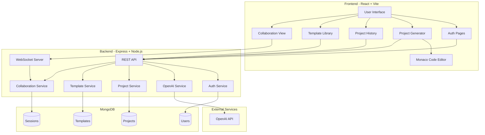

# AI Project Generator - Architecture Plan

## Project Overview
A full-stack application that takes user ideas and generates complete project structures with code using OpenAI's GPT API.

## Technology Stack

### Frontend
- **Framework**: React 18 with Vite
- **Language**: TypeScript
- **Styling**: TailwindCSS
- **Routing**: React Router v6
- **State Management**: React Context API + Hooks
- **HTTP Client**: Axios
- **Code Editor**: Monaco Editor (VS Code editor)
- **Real-time**: Socket.io Client
- **UI Components**: Headless UI, Heroicons
- **File Handling**: JSZip for ZIP generation

### Backend
- **Runtime**: Node.js 18+
- **Framework**: Express.js
- **Language**: TypeScript
- **Database**: MongoDB with Mongoose ODM
- **Authentication**: JWT (jsonwebtoken) + bcrypt
- **AI Integration**: OpenAI API (GPT-4)
- **Real-time**: Socket.io
- **Validation**: express-validator
- **File Generation**: Archiver for ZIP files
- **Environment**: dotenv

## System Architecture



## Database Schema

### User Schema
```typescript
{
  _id: ObjectId,
  email: string (unique, required),
  password: string (hashed, required),
  name: string (required),
  createdAt: Date,
  updatedAt: Date,
  projects: [ObjectId] (ref: Project)
}
```

### Project Schema
```typescript
{
  _id: ObjectId,
  userId: ObjectId (ref: User),
  name: string (required),
  description: string,
  idea: string (original user input),
  techStack: {
    frontend: string[],
    backend: string[],
    database: string,
    other: string[]
  },
  files: [{
    path: string,
    content: string,
    language: string
  }],
  structure: object (directory tree),
  status: enum ['generating', 'completed', 'failed'],
  collaborators: [ObjectId] (ref: User),
  createdAt: Date,
  updatedAt: Date
}
```

### Template Schema
```typescript
{
  _id: ObjectId,
  name: string (required),
  description: string,
  category: string,
  techStack: string[],
  files: [{
    path: string,
    content: string,
    language: string
  }],
  isPublic: boolean,
  createdBy: ObjectId (ref: User),
  usageCount: number,
  createdAt: Date,
  updatedAt: Date
}
```

### Session Schema (for collaboration)
```typescript
{
  _id: ObjectId,
  projectId: ObjectId (ref: Project),
  activeUsers: [{
    userId: ObjectId,
    socketId: string,
    cursor: { line: number, column: number }
  }],
  lastActivity: Date
}
```

## API Endpoints

### Authentication
- `POST /api/auth/register` - Register new user
- `POST /api/auth/login` - Login user
- `GET /api/auth/me` - Get current user
- `POST /api/auth/logout` - Logout user

### Projects
- `POST /api/projects/generate` - Generate new project from idea
- `GET /api/projects` - Get user's projects
- `GET /api/projects/:id` - Get specific project
- `PUT /api/projects/:id` - Update project
- `DELETE /api/projects/:id` - Delete project
- `GET /api/projects/:id/download` - Download project as ZIP

### Templates
- `GET /api/templates` - Get all public templates
- `GET /api/templates/:id` - Get specific template
- `POST /api/templates` - Create new template
- `PUT /api/templates/:id` - Update template
- `DELETE /api/templates/:id` - Delete template
- `POST /api/templates/:id/use` - Use template for project

### Collaboration
- `POST /api/collaborate/:projectId/invite` - Invite user to collaborate
- `GET /api/collaborate/:projectId/users` - Get active collaborators
- `DELETE /api/collaborate/:projectId/remove/:userId` - Remove collaborator

### WebSocket Events
- `join-project` - Join project collaboration session
- `leave-project` - Leave project session
- `code-change` - Broadcast code changes
- `cursor-move` - Broadcast cursor position
- `user-joined` - Notify when user joins
- `user-left` - Notify when user leaves

## Frontend Structure

```
frontend/
├── src/
│   ├── components/
│   │   ├── auth/
│   │   │   ├── LoginForm.tsx
│   │   │   ├── RegisterForm.tsx
│   │   │   └── ProtectedRoute.tsx
│   │   ├── generator/
│   │   │   ├── IdeaInput.tsx
│   │   │   ├── TechStackSelector.tsx
│   │   │   ├── GenerationProgress.tsx
│   │   │   └── ProjectPreview.tsx
│   │   ├── editor/
│   │   │   ├── CodeEditor.tsx
│   │   │   ├── FileTree.tsx
│   │   │   └── CollaboratorCursors.tsx
│   │   ├── history/
│   │   │   ├── ProjectList.tsx
│   │   │   └── ProjectCard.tsx
│   │   ├── templates/
│   │   │   ├── TemplateGallery.tsx
│   │   │   ├── TemplateCard.tsx
│   │   │   └── TemplateEditor.tsx
│   │   ├── common/
│   │   │   ├── Header.tsx
│   │   │   ├── Sidebar.tsx
│   │   │   ├── Button.tsx
│   │   │   ├── Modal.tsx
│   │   │   └── LoadingSpinner.tsx
│   │   └── collaboration/
│   │       ├── CollaboratorList.tsx
│   │       └── InviteModal.tsx
│   ├── contexts/
│   │   ├── AuthContext.tsx
│   │   ├── ProjectContext.tsx
│   │   └── SocketContext.tsx
│   ├── hooks/
│   │   ├── useAuth.ts
│   │   ├── useProject.ts
│   │   ├── useSocket.ts
│   │   └── useTemplates.ts
│   ├── services/
│   │   ├── api.ts
│   │   ├── auth.service.ts
│   │   ├── project.service.ts
│   │   ├── template.service.ts
│   │   └── socket.service.ts
│   ├── types/
│   │   ├── user.types.ts
│   │   ├── project.types.ts
│   │   └── template.types.ts
│   ├── utils/
│   │   ├── fileDownload.ts
│   │   ├── codeFormatter.ts
│   │   └── validation.ts
│   ├── pages/
│   │   ├── Home.tsx
│   │   ├── Login.tsx
│   │   ├── Register.tsx
│   │   ├── Dashboard.tsx
│   │   ├── Generator.tsx
│   │   ├── ProjectView.tsx
│   │   ├── History.tsx
│   │   └── Templates.tsx
│   ├── App.tsx
│   ├── main.tsx
│   └── index.css
├── public/
├── index.html
├── package.json
├── tsconfig.json
├── vite.config.ts
└── tailwind.config.js
```

## Backend Structure

```
backend/
├── src/
│   ├── config/
│   │   ├── database.ts
│   │   ├── openai.ts
│   │   └── socket.ts
│   ├── models/
│   │   ├── User.ts
│   │   ├── Project.ts
│   │   ├── Template.ts
│   │   └── Session.ts
│   ├── controllers/
│   │   ├── auth.controller.ts
│   │   ├── project.controller.ts
│   │   ├── template.controller.ts
│   │   └── collaboration.controller.ts
│   ├── services/
│   │   ├── auth.service.ts
│   │   ├── openai.service.ts
│   │   ├── project.service.ts
│   │   ├── template.service.ts
│   │   └── file.service.ts
│   ├── middleware/
│   │   ├── auth.middleware.ts
│   │   ├── validation.middleware.ts
│   │   └── error.middleware.ts
│   ├── routes/
│   │   ├── auth.routes.ts
│   │   ├── project.routes.ts
│   │   ├── template.routes.ts
│   │   └── collaboration.routes.ts
│   ├── utils/
│   │   ├── jwt.ts
│   │   ├── zipGenerator.ts
│   │   └── logger.ts
│   ├── types/
│   │   ├── express.d.ts
│   │   └── index.ts
│   ├── socket/
│   │   ├── handlers.ts
│   │   └── events.ts
│   └── server.ts
├── .env.example
├── package.json
├── tsconfig.json
└── nodemon.json
```

## Key Features Implementation

### 1. AI Code Generation Flow
1. User enters project idea and selects tech stack
2. Frontend sends request to backend API
3. Backend constructs prompt for OpenAI
4. OpenAI generates project structure and code
5. Backend parses response and stores in database
6. Frontend displays generated files with syntax highlighting
7. User can download as ZIP or continue editing

### 2. Real-time Collaboration
1. User opens project and joins collaboration session
2. Socket.io establishes WebSocket connection
3. Multiple users can edit simultaneously
4. Changes broadcast to all connected users
5. Cursor positions shown for each collaborator
6. Conflict resolution using operational transformation

### 3. Template System
1. Users can save generated projects as templates
2. Templates stored in database with metadata
3. Public templates available in gallery
4. Users can fork and customize templates
5. Template usage tracked for popularity

### 4. Authentication & Authorization
1. JWT-based authentication
2. Tokens stored in httpOnly cookies
3. Protected routes on frontend and backend
4. Role-based access control for templates
5. Project ownership and collaboration permissions

## Environment Variables

### Frontend (.env)
```
VITE_API_URL=http://localhost:5000
VITE_SOCKET_URL=http://localhost:5000
```

### Backend (.env)
```
PORT=5000
MONGODB_URI=mongodb://localhost:27017/project-generator
JWT_SECRET=your-secret-key
JWT_EXPIRE=7d
OPENAI_API_KEY=your-openai-api-key
NODE_ENV=development
CORS_ORIGIN=http://localhost:5173
```

## Development Workflow

1. Start MongoDB server
2. Start backend server (port 5000)
3. Start frontend dev server (port 5173)
4. Access application at http://localhost:5173

## Security Considerations

- Password hashing with bcrypt (10 rounds)
- JWT tokens with expiration
- Input validation and sanitization
- Rate limiting on API endpoints
- CORS configuration
- Environment variable protection
- SQL injection prevention (using Mongoose)
- XSS protection

## Performance Optimizations

- Code splitting in React
- Lazy loading of components
- Debouncing for real-time updates
- Caching of templates
- Pagination for project lists
- Compression middleware
- MongoDB indexing on frequently queried fields

## Future Enhancements

- GitHub integration for direct repository creation
- Version control for projects
- AI-powered code suggestions
- Multi-language support
- Project sharing via public links
- Advanced template marketplace
- CI/CD pipeline generation
- Docker containerization support