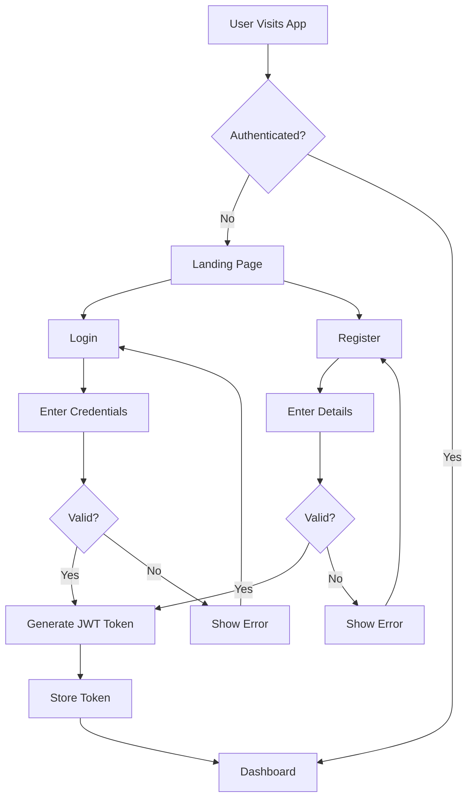
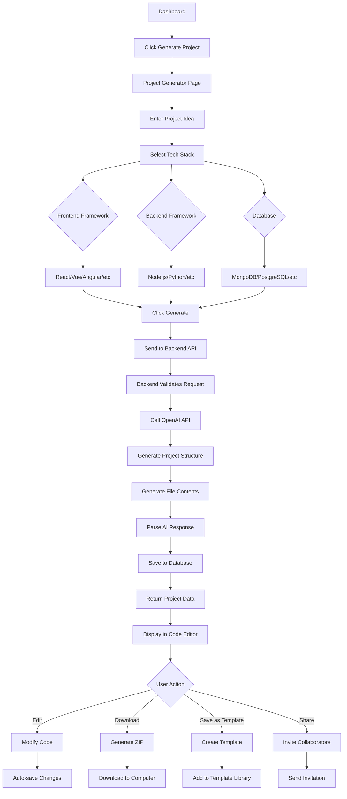
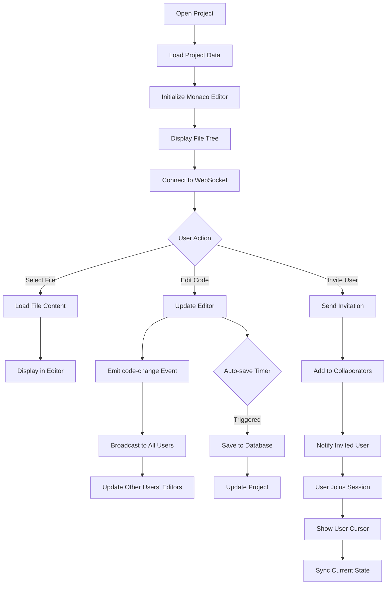
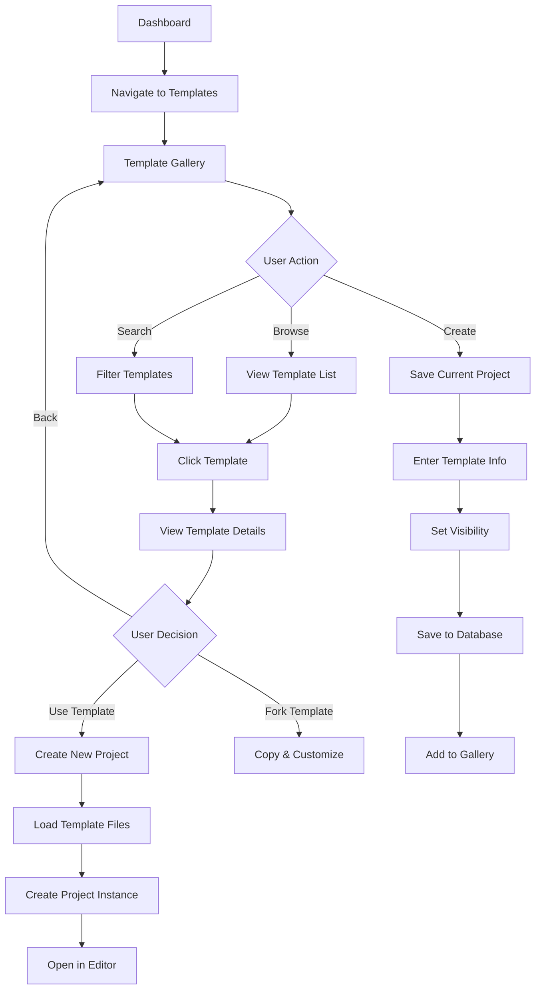
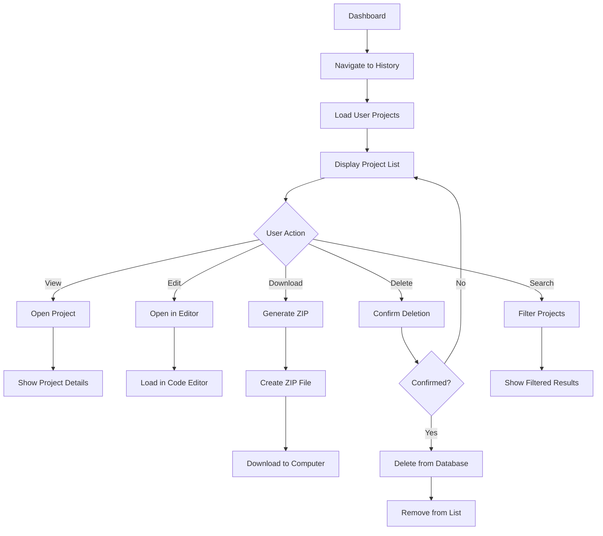
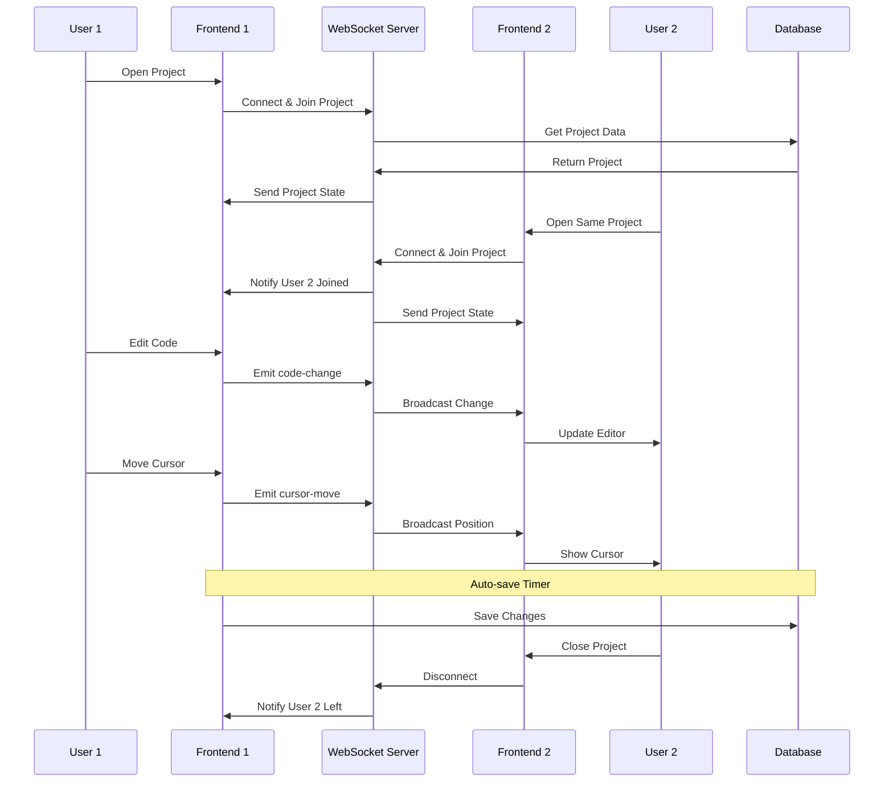
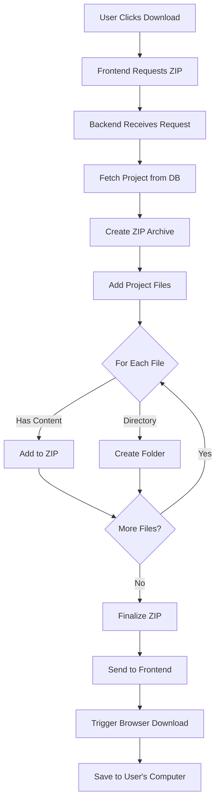
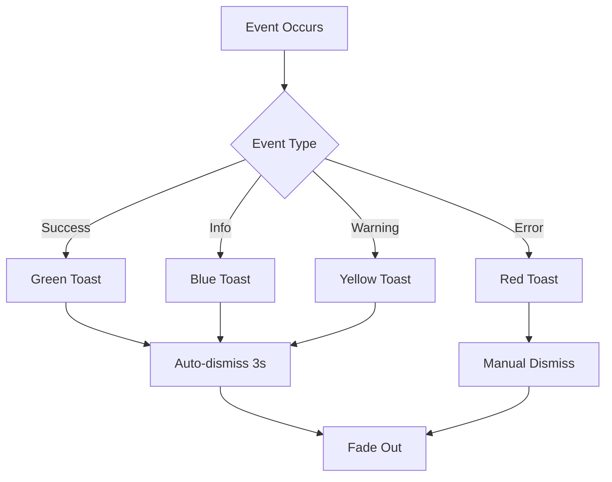

# AI Project Generator - User Workflow

This document illustrates the key user workflows and interactions within the application.

## 🔐 Authentication Flow

## 🚀 Project Generation Flow

## 📝 Code Editing & Collaboration Flow

## 📚 Template Usage Flow

## 📜 Project History Flow

## 🔄 Real-time Collaboration Details

## 📦 Download Project Flow

## 🎯 Key User Journeys

### Journey 1: First-Time User Creating a Project

1. **Discover** → User lands on homepage
2. **Register** → Creates account with email/password
3. **Onboard** → Views dashboard and features
4. **Generate** → Enters project idea and selects tech stack
5. **Wait** → AI generates project (15-30 seconds)
6. **Review** → Views generated code in editor
7. **Customize** → Makes minor adjustments
8. **Download** → Exports project as ZIP
9. **Develop** → Continues development locally

### Journey 2: Experienced User Using Templates

1. **Login** → Authenticates with credentials
2. **Browse** → Explores template gallery
3. **Select** → Chooses relevant template
4. **Customize** → Modifies template for specific needs
5. **Generate** → Creates project from template
6. **Save** → Saves customized version as new template
7. **Share** → Makes template public for community

### Journey 3: Team Collaboration

1. **Create** → User A generates a project
2. **Invite** → User A invites User B via email
3. **Join** → User B accepts invitation
4. **Collaborate** → Both users edit simultaneously
5. **Sync** → Changes sync in real-time
6. **Review** → Team reviews final code
7. **Export** → Download completed project

## 🎨 UI/UX Considerations

### Loading States
- **Project Generation**: Progress bar with status messages
- **File Loading**: Skeleton loaders for code editor
- **API Calls**: Spinner with timeout handling
- **Real-time Updates**: Smooth transitions for changes

### Error Handling
- **Network Errors**: Retry mechanism with user notification
- **Validation Errors**: Inline error messages
- **AI Failures**: Fallback options and clear error messages
- **Auth Errors**: Redirect to login with context preservation

### Responsive Design
- **Desktop**: Full-featured editor with sidebar
- **Tablet**: Collapsible sidebar, touch-friendly controls
- **Mobile**: Simplified view, essential features only

### Accessibility
- **Keyboard Navigation**: Full keyboard support
- **Screen Readers**: ARIA labels and semantic HTML
- **Color Contrast**: WCAG AA compliant
- **Focus Indicators**: Clear visual feedback

## 🔔 Notification System

### Notification Types
- **Project Generated**: Success notification with link
- **Collaborator Joined**: Info notification with user name
- **Save Failed**: Error notification with retry option
- **Template Created**: Success notification with view link
- **Invitation Sent**: Success notification with confirmation

## 📊 Analytics & Tracking (Future Enhancement)

Potential metrics to track:
- Project generation success rate
- Average generation time
- Most popular tech stacks
- Template usage statistics
- Collaboration session duration
- User retention rate
- Feature adoption rate

---

This workflow documentation helps understand the complete user experience and technical flow of the AI Project Generator application.